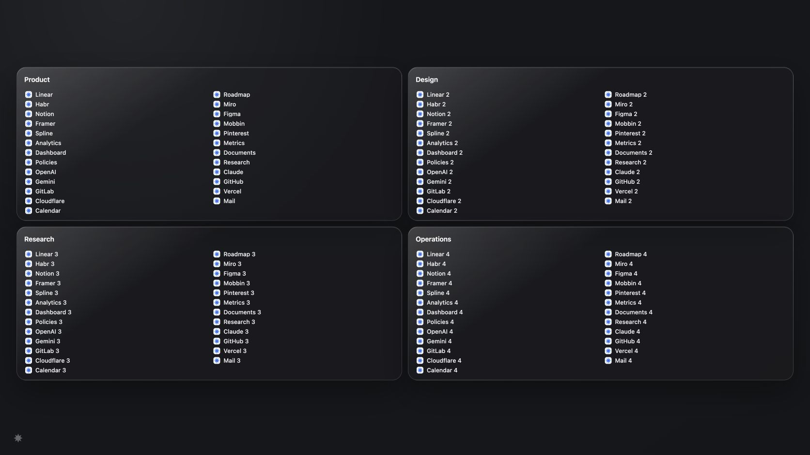
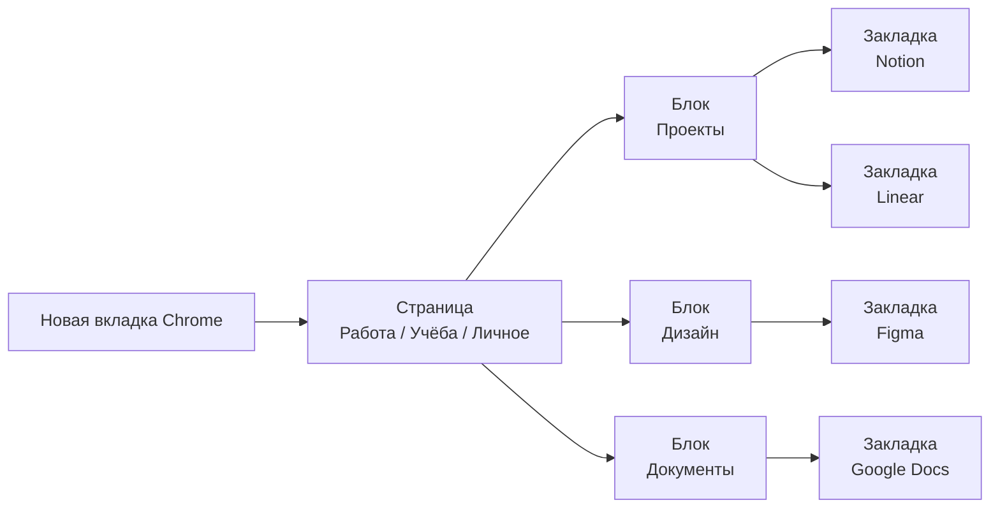
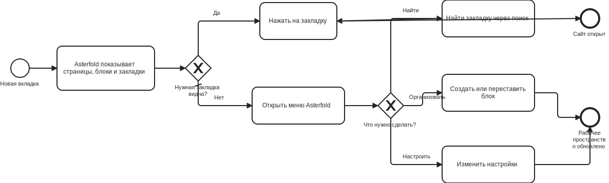
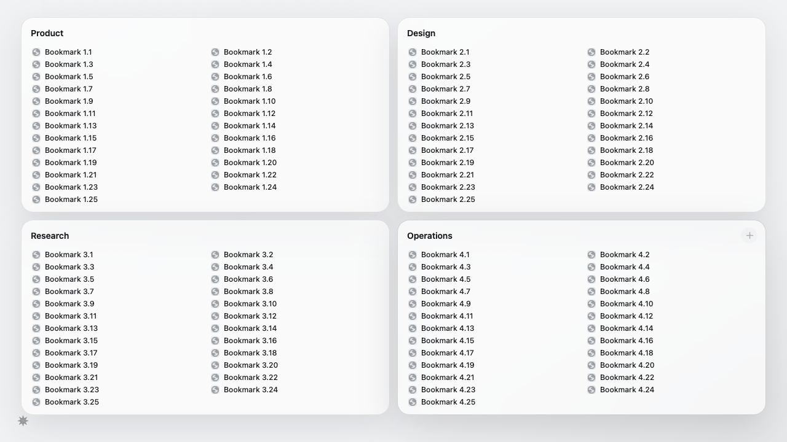
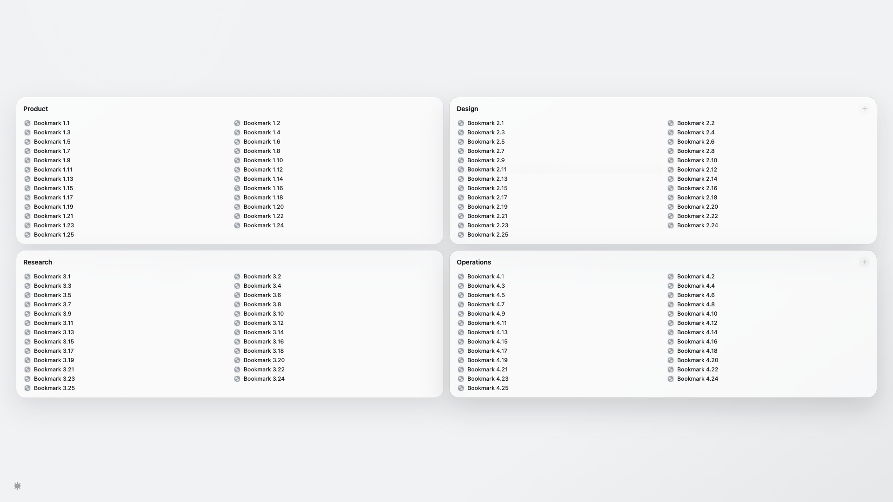
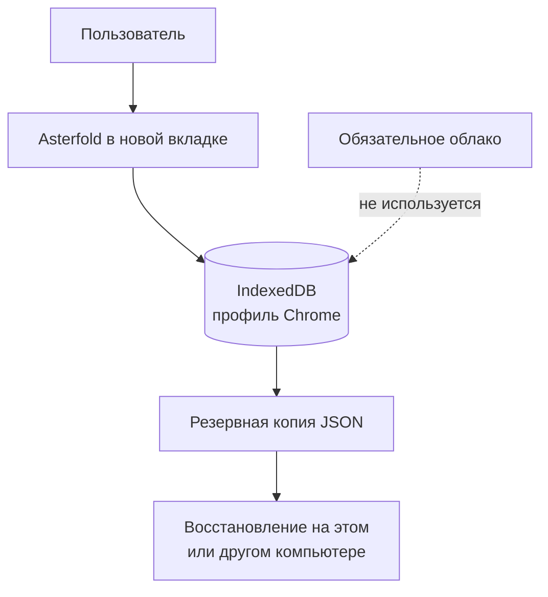

<div align="center">
  
  <h1>Asterfold</h1>
  <p><strong>Новая вкладка Chrome, в которой все важные сайты уже разложены по местам.</strong></p>
  <p>Локально · Без регистрации · 12 выбираемых языков · Manifest V3</p>
</div>



<p align="center">
  <strong>Открыл новую вкладку → увидел нужный блок → нажал на сайт.</strong><br />
  Никаких длинных меню, лишних панелей и поиска закладок по всему Chrome.
</p>

## Быстрый обзор

| Что вы хотите сделать | Что нажать |
|---|---|
| Открыть сохранённый сайт | Нажать на его название |
| Добавить ссылку | Навести на блок и нажать `+` |
| Создать новую группу | Знак Asterfold → **Новый блок** |
| Найти сайт | Знак Asterfold → **Поиск** или `Ctrl/Cmd + K` |
| Изменить внешний вид | Знак Asterfold → **Настройки** |
| Вернуть удалённое | Знак Asterfold → **Корзина** |

## Что это такое — совсем просто

Представьте школьный стол:

- **страница** — это отдельный стол, например «Учёба» или «Работа»;
- **блок** — это коробка на столе, например «Математика» или «Дизайн»;
- **закладка** — это ссылка внутри коробки.

Вы открываете новую вкладку — и сразу видите все нужные сайты. Не нужно искать их в длинном меню Chrome.

```text
Страница «Работа»
├── Блок «Проекты»
│   ├── Notion
│   ├── Linear
│   └── GitHub
└── Блок «Дизайн»
    ├── Figma
    └── Mobbin
```

## Как продукт работает

1. Откройте новую вкладку Chrome.
2. Нажмите маленький знак Asterfold в левом нижнем углу.
3. Создайте блок и добавьте в него ссылки.

Дальше можно перетаскивать блоки и закладки мышкой, искать нужный сайт и создавать отдельные страницы под разные задачи.

### Карта продукта



### Пользовательский путь в BPMN 2.0



Полную редактируемую схему можно открыть в любом BPMN 2.0 редакторе: [asterfold-user-flow.bpmn](docs/diagrams/asterfold-user-flow.bpmn).

## Что умеет Asterfold

| Возможность | Простое объяснение |
|---|---|
| Страницы | Разделяют работу, учёбу и личные ссылки |
| Блоки | Собирают похожие закладки в одну группу |
| Drag-and-drop | Блоки и ссылки можно переставлять мышкой |
| Quick Save | Быстро сохраняет текущий сайт через popup расширения |
| Поиск | Находит ссылку по названию или адресу |
| Privacy Mode | Временно скрывает названия закладок |
| Корзина | Позволяет вернуть случайно удалённые данные |
| Импорт и экспорт | Создаёт резервную копию и переносит закладки |
| 12 языков интерфейса | Автоопределение языка Chrome и ручной выбор; RU/KK/EN полные, редкие строки остальных языков безопасно используют English |
| Светлая и тёмная тема | Может следовать теме системы автоматически |
| Обои и стекло | Можно выбрать фон, прозрачность и размытие |

Все данные хранятся **локально на компьютере** в IndexedDB. Для основной работы не нужны регистрация, облако, API-ключ или аналитика.

## Интерфейс

На экране нет постоянной панели, верхнего меню и лишних кнопок. Единственный постоянный элемент — полупрозрачный знак Asterfold снизу слева.

При нажатии он открывает меню:

- новый блок;
- страницы;
- поиск;
- приватность;
- корзина;
- настройки.


В настройках пять понятных разделов: внешний вид, компоновка, язык, Quick Save, данные и приватность.

### Как выглядит при 100 закладках

| 1280 × 720 | 1920 × 1080 |
|---|---|
|  |  |

## Как установить готовое расширение

1. Скачайте репозиторий и распакуйте его.
2. Откройте в Chrome адрес `chrome://extensions`.
3. Включите **Режим разработчика**.
4. Нажмите **Загрузить распакованное расширение**.
5. Выберите папку `release/chrome-unpacked`.
6. Откройте новую вкладку.

Подробная инструкция находится в [docs/release/install.md](docs/release/install.md).

## Как пользоваться

### Добавить блок

Откройте меню Asterfold → **Новый блок** → введите название.

### Добавить закладку

Наведите указатель на заголовок блока → нажмите появившийся `+` → укажите название и URL.

### Переставить элементы

Перетащите блок или закладку в новое место. Для клавиатуры блоки переставляются через `Alt + ←/→`.

### Открыть действия

Нажмите правой кнопкой на блок или закладку. С клавиатуры используйте `Shift + F10`.

### Найти ссылку

Откройте меню → **Поиск** или нажмите `Ctrl/Cmd + K`.

## Вместимость и производительность

- Проверено 100 закладок в четырёх блоках.
- На десктопных экранах 1280×720, 1672×941 и 1920×1080 они помещаются без внутренней прокрутки.
- В Balanced размытие применяется один раз к workspace; блоки и строки не создают отдельные GPU blur-слои.
- Тяжёлые окна поиска, настроек, корзины и редактора загружаются только при открытии.
- Никакого отдельного animation runtime: используются CSS, Web Animations API и существующий `dnd-kit`.

## Безопасность данных

- Основное хранилище — IndexedDB в профиле Chrome.
- Backup v2 экспортируется в JSON.
- Старые backup v1 продолжают импортироваться.
- Удалённые элементы сначала попадают в корзину.
- Расширение не запрашивает доступ к истории, содержимому сайтов или всем вкладкам.

Резервную копию всё равно стоит периодически сохранять через **Настройки → Данные и приватность**.

### Куда идут данные



## Для разработчиков

Технологии: React 19, TypeScript, WXT, Dexie/IndexedDB, dnd-kit, MiniSearch и Vitest.

```bash
npm ci
npm run typecheck
npm run lint
npm test
npm run build
npm run test:e2e
npm run release
```

Готовая Manifest V3 сборка появляется в `release/chrome-unpacked`.

### Структура проекта

```text
entrypoints/          страницы расширения: new tab, popup, background
src/app/              главный экран и меню Asterfold
src/features/         блоки, закладки, поиск, настройки и корзина
src/db/               IndexedDB, миграции и операции с данными
src/i18n/             тексты интерфейса и языковой выбор
tests/                unit и integration тесты
e2e/                  проверка настоящей MV3 сборки в Chromium
docs/                 документация, схемы и проверенные скриншоты
```

Для изменений в коде есть [краткое руководство разработчика](docs/development/CONTRIBUTING.md).

## Статус проекта

Asterfold 2.2.0 — production-hardening ветка local-first расширения. Она не требует аккаунта, сохраняет данные и `openMode` при миграциях, а default build не содержит cloud-клиента.

## История версий

На странице [Releases](https://github.com/memodlike/Asterfold/releases) GitHub всегда показывает свежую версию первой. Если прокрутить ниже, будут предыдущие версии. Для обычной установки скачивайте только самый верхний файл **`Asterfold-Chrome.zip`**.

1. **v2.2.0 — hardening данных, безопасности и выпуска.** Централизована безопасная навигация, усилены миграции/backup/import/order, добавлены Low Power и a11y gates, cloud исключён из default build, архивы воспроизводимы.
2. **v2.1.3 — единый языковой слой.** Ошибки, уведомления, импорт, Quick Save, подсказки и подписи доступности проходят через общий словарь.
3. **v2.1.2 — Search и Trash.** Поиск и корзина получили единый стеклянный дизайн.
4. **v2.1.1 — контраст и вкладка Chrome.** Контекстное меню открывается поверх интерфейса, favicon стал нейтральным.
5. **v2.1.0 — языки и переходы.** Добавлены европейские языки и текущая вкладка как стандартный режим.
6. **v2.0.3 — меню и ручная производительность.** Исправлены края меню и ручные настройки эффектов.
7. **v2.0.2 — лёгкий режим.** Добавлен режим для слабых ПК.
8. **v2.0.1 — правильная установка в Chrome.** `manifest.json` находится в корне установочного архива.
9. **v2.0.0 — большой редизайн.** Новая вкладка Pages → Boards → Bookmarks.
