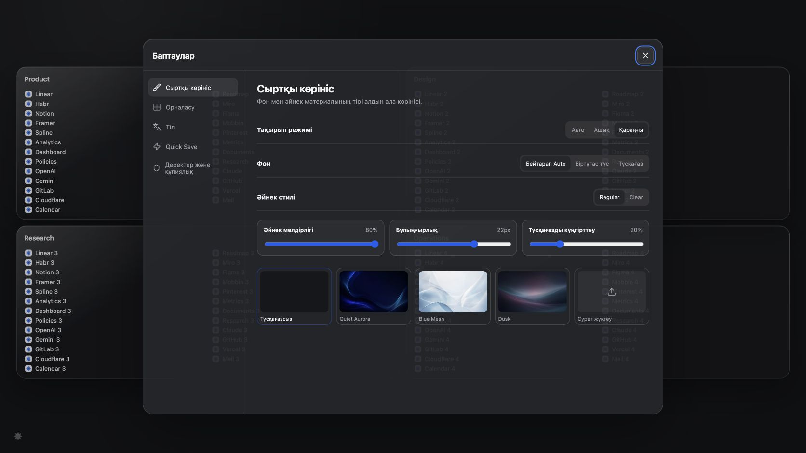

# Asterfold

> Asterfold превращает новую вкладку Chrome в аккуратный рабочий стол для закладок.


## Что это такое — совсем просто

Представьте школьный стол:

- **страница** — это отдельный стол, например «Учёба» или «Работа»;
- **блок** — это коробка на столе, например «Математика» или «Дизайн»;
- **закладка** — это ссылка внутри коробки.

Вы открываете новую вкладку — и сразу видите все нужные сайты. Не нужно искать их в длинном меню Chrome.

```text
Страница «Работа»
├── Блок «Проекты»
│   ├── Notion
│   ├── Linear
│   └── GitHub
└── Блок «Дизайн»
    ├── Figma
    └── Mobbin
```

## Как продукт работает

1. Откройте новую вкладку Chrome.
2. Нажмите маленький знак Asterfold в левом нижнем углу.
3. Создайте блок и добавьте в него ссылки.

Дальше можно перетаскивать блоки и закладки мышкой, искать нужный сайт и создавать отдельные страницы под разные задачи.

## Что умеет Asterfold

| Возможность | Простое объяснение |
|---|---|
| Страницы | Разделяют работу, учёбу и личные ссылки |
| Блоки | Собирают похожие закладки в одну группу |
| Drag-and-drop | Блоки и ссылки можно переставлять мышкой |
| Quick Save | Быстро сохраняет текущий сайт через popup расширения |
| Поиск | Находит ссылку по названию или адресу |
| Privacy Mode | Временно скрывает названия закладок |
| Корзина | Позволяет вернуть случайно удалённые данные |
| Импорт и экспорт | Создаёт резервную копию и переносит закладки |
| Русский и қазақша | Язык меняется внутри настроек |
| Светлая и тёмная тема | Может следовать теме системы автоматически |
| Обои и стекло | Можно выбрать фон, прозрачность и размытие |

Все данные хранятся **локально на компьютере** в IndexedDB. Для основной работы не нужны регистрация, облако, API-ключ или аналитика.

## Интерфейс

На экране нет постоянной панели, верхнего меню и лишних кнопок. Единственный постоянный элемент — полупрозрачный знак Asterfold снизу слева.

При нажатии он открывает меню:

- новый блок;
- страницы;
- поиск;
- приватность;
- корзина;
- настройки.



В настройках пять понятных разделов: внешний вид, компоновка, язык, Quick Save, данные и приватность.

## Как установить готовое расширение

1. Скачайте репозиторий и распакуйте его.
2. Откройте в Chrome адрес `chrome://extensions`.
3. Включите **Режим разработчика**.
4. Нажмите **Загрузить распакованное расширение**.
5. Выберите папку `release/chrome-unpacked`.
6. Откройте новую вкладку.

Подробная инструкция находится в [INSTALL.md](INSTALL.md).

## Как пользоваться

### Добавить блок

Откройте меню Asterfold → **Новый блок** → введите название.

### Добавить закладку

Наведите указатель на заголовок блока → нажмите появившийся `+` → укажите название и URL.

### Переставить элементы

Перетащите блок или закладку в новое место. Для клавиатуры блоки переставляются через `Alt + ←/→`.

### Открыть действия

Нажмите правой кнопкой на блок или закладку. С клавиатуры используйте `Shift + F10`.

### Найти ссылку

Откройте меню → **Поиск** или нажмите `Ctrl/Cmd + K`.

## Вместимость и производительность

- Проверено 100 закладок в четырёх блоках.
- На десктопных экранах 1280×720, 1672×941 и 1920×1080 они помещаются без внутренней прокрутки.
- Размытие применяется один раз на блок, а не на каждую строку.
- Тяжёлые окна поиска, настроек, корзины и редактора загружаются только при открытии.
- Никакого отдельного animation runtime: используются CSS, Web Animations API и существующий `dnd-kit`.

## Безопасность данных

- Основное хранилище — IndexedDB в профиле Chrome.
- Backup v2 экспортируется в JSON.
- Старые backup v1 продолжают импортироваться.
- Удалённые элементы сначала попадают в корзину.
- Расширение не запрашивает доступ к истории, содержимому сайтов или всем вкладкам.

Резервную копию всё равно стоит периодически сохранять через **Настройки → Данные и приватность**.

## Для разработчиков

Технологии: React 19, TypeScript, WXT, Dexie/IndexedDB, dnd-kit, MiniSearch и Vitest.

```bash
npm ci
npm run typecheck
npm run lint
npm test
npm run build
npm run test:e2e
npm run release
```

Готовая Manifest V3 сборка появляется в `release/chrome-unpacked`.

### Структура проекта

```text
entrypoints/          страницы расширения: new tab, popup, background
src/app/              главный экран и меню Asterfold
src/features/         блоки, закладки, поиск, настройки и корзина
src/db/               IndexedDB, миграции и операции с данными
src/i18n/             русские и казахские тексты
tests/                unit и integration тесты
e2e/                  проверка настоящей MV3 сборки в Chromium
release/chrome-unpacked/ готовая папка для Chrome
```

Перед изменениями прочитайте [AGENTS.md](AGENTS.md). Отчёт о визуальной проверке находится в [design-qa.md](design-qa.md).

## Статус проекта

Asterfold 1.0.0 — рабочее local-first расширение. Оно не требует аккаунта и готово к локальной установке через `release/chrome-unpacked`.
