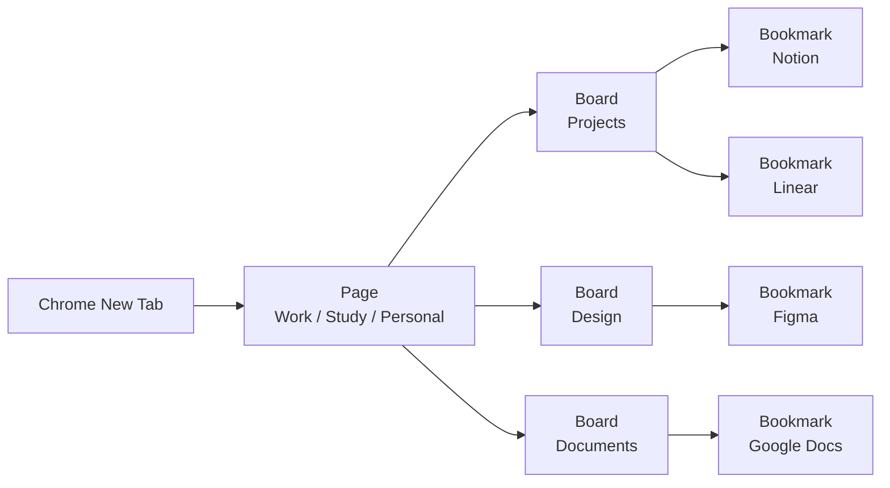

<div align="center">
  
  <h1>Asterfold</h1>
  <p><strong>A local-first visual bookmark workspace for the Chrome New Tab page.</strong></p>
  <p>No account · No analytics · 12 selectable interface languages · Manifest V3</p>
</div>


<p align="center">
  <strong>Open a new tab, find the right board, and launch the site you need.</strong><br />
  No crowded browser menus, permanent toolbars, or cloud account required.
</p>

## Overview

Asterfold replaces the Chrome New Tab page with a structured bookmark workspace:

- **Pages** separate work, study, personal, or project contexts.
- **Boards** group related bookmarks inside each Page.
- **Bookmarks** open in the current tab, a new tab, or a new window.

```text
Page: Work
├── Board: Projects
│   ├── Notion
│   ├── Linear
│   └── GitHub
└── Board: Design
    ├── Figma
    └── Mobbin
```

## Main features

| Feature | What it does |
|---|---|
| Pages and Boards | Organizes bookmarks by context and topic |
| Drag and drop | Reorders Boards and Bookmarks visually |
| Quick Save | Saves the active tab from the extension popup |
| Search | Finds bookmarks by title or URL with `Ctrl/Cmd + K` |
| Privacy Mode | Temporarily hides bookmark titles and URLs in New Tab and popup |
| Trash | Restores accidentally deleted Pages, Boards, and Bookmarks |
| Import and export | Supports Asterfold JSON backups, Netscape HTML, and optional Chrome bookmark import |
| 12 interface languages | Full English, Russian, and Kazakh coverage with safe English fallback for rare strings |
| Light and dark themes | Follows the system theme or uses a selected mode |
| Wallpaper controls | Adjusts background, surface opacity, blur, dimming, and saturation |
| Low Power Mode | Reduces visual effects for lower-end devices |

All primary data is stored locally in the Chrome profile through IndexedDB.

## Product flow


```mermaid
flowchart LR
    Chrome["Chrome New Tab"] --> Page["Page<br/>Work / Study / Personal"]
    Page --> Board1["Board<br/>Projects"]
    Page --> Board2["Board<br/>Design"]
    Page --> Board3["Board<br/>Documents"]
    Board1 --> Link1["Bookmark<br/>Notion"]
    Board1 --> Link2["Bookmark<br/>Linear"]
    Board2 --> Link3["Bookmark<br/>Figma"]
    Board3 --> Link4["Bookmark<br/>Google Docs"]
```

The editable BPMN 2.0 user-flow model is available at [docs/diagrams/asterfold-user-flow.bpmn](docs/diagrams/asterfold-user-flow.bpmn).

## Interface

Asterfold keeps the workspace visually quiet. The only permanent control is the Asterfold launcher in the lower-left corner.

The launcher provides access to:

- new Board creation;
- Page management;
- search;
- Privacy Mode;
- Trash;
- settings.


### Scale validation

| 1280 × 720 | 1920 × 1080 |
|---|---|
|  |  |

The release E2E suite validates 100 bookmarks across four Boards without desktop-page scrolling at 1280×720, 1672×941, and 1920×1080.

## Privacy and security

Asterfold is designed around local storage and least-privilege extension access.

- No account is required.
- No analytics or advertising SDK is included.
- No host permissions are requested.
- No content scripts are injected into websites.
- No browsing history permission is requested.
- No remote executable code is loaded.
- Backup files are created only after an explicit user action.
- Chrome bookmark access is optional and requested only from the explicit import action.

### Required permissions

| Permission | Purpose |
|---|---|
| `activeTab` | Reads the active tab only after the user opens Quick Save |
| `favicon` | Displays Chrome-provided favicons without broad website access |
| `alarms` | Runs local maintenance and reminder tasks |
| `contextMenus` | Adds explicit Asterfold browser actions |
| `storage` | Stores only the transient cross-context Privacy Mode flag in `chrome.storage.session` |

### Optional permission

| Permission | Purpose |
|---|---|
| `bookmarks` | Imports Chrome bookmarks after direct user approval |

Detailed review material:

- [Privacy policy](docs/security/privacy.md)
- [Static privacy-policy page](docs/store/privacy.html)
- [Permission rationale](docs/security/permissions.md)
- [Chrome Web Store privacy-practice answers](docs/store/privacy-practices.md)
- [Chrome Web Store submission checklist](docs/store/submission-checklist.md)

## Install the unpacked build

1. Download and extract the latest GitHub Release.
2. Open `chrome://extensions` in Chrome.
3. Enable **Developer mode**.
4. Select **Load unpacked**.
5. Choose the extracted `chrome-unpacked` folder containing `manifest.json`.
6. Open a new tab.

For normal installation, use the latest **`Asterfold-Chrome.zip`** release asset. Do not use GitHub's automatically generated source archive as an extension package.

See [docs/release/install.md](docs/release/install.md) for the full installation guide.

## Development

### Requirements

- Node.js 22 or newer
- npm
- Chromium or Google Chrome for real-extension E2E tests

### Validate the project

```bash
npm ci
npm run typecheck
npm run lint
npm run test:coverage
npm run build
npm run test:e2e
npm run release:repro
```

The project uses React 19, TypeScript, WXT, Dexie/IndexedDB, dnd-kit, MiniSearch, Vitest, Playwright, and Axe.

### Project structure

```text
entrypoints/          New Tab, popup, and service-worker entrypoints
src/app/              Workspace shell and launcher
src/features/         Boards, Bookmarks, search, settings, and Trash
src/db/               IndexedDB schema, migrations, and transactions
src/i18n/             Interface dictionaries and locale selection
tests/                Unit and integration tests
e2e/                  Real unpacked-MV3 Playwright tests
docs/                 Architecture, security, release, and review documentation
store-assets/         Chrome Web Store screenshots and promotional assets
```

Contribution guidance is available in [docs/development/CONTRIBUTING.md](docs/development/CONTRIBUTING.md).

## Release artifacts

A reproducible release contains:

- `Asterfold-Chrome.zip` — upload/install package with `manifest.json` at the ZIP root;
- `chrome-unpacked.zip` — unpacked folder wrapper;
- `extension-source.zip` — reviewable source snapshot;
- `Asterfold-Store-Assets.zip` — listing, screenshots, promo images, and review documentation;
- `checksums.txt` — SHA-256 checksums for all release archives.

The release pipeline verifies Manifest V3 structure, permission policy, CSP, forbidden files, remote-code patterns, Store asset dimensions, Windows packaging, CodeQL, accessibility, and real unpacked-extension behavior.

## Current status

**Asterfold 2.2.3** is a local-first Manifest V3 release prepared for Chrome Web Store submission.

The repository does not claim Chrome Web Store publication, approval, user counts, ratings, awards, or endorsements until those facts exist publicly.

## Version history

1. **v2.2.3 — Chrome Web Store readiness.** Fixed Quick Save destination validation, cross-context session Privacy Mode, scoped restore safety, bounded imports, HTML description round-trip, atomic free-grid moves, settings races, and release gates.
2. **v2.2.2 — Data and privacy hardening.** Improved scoped backups, deleted-data merge behavior, Quick Save, atomic moves and Undo, wallpaper handling, Page actions, and background reliability.
3. **v2.2.1 — Store submission package.** Added verifiable Store collateral, privacy documentation, and backup v3 wallpaper support.
4. **v2.2.0 — Security and release hardening.** Centralized safe navigation, strengthened migrations/import/order handling, added Low Power and accessibility gates, and made release archives reproducible.
5. **v2.1.x — Localization, Search, Trash, contrast, and keyboard improvements.**
6. **v2.0.x — Pages → Boards → Bookmarks redesign and correct Chrome packaging.**

The newest published build is always listed first on the [GitHub Releases page](https://github.com/memodlike/Asterfold/releases).